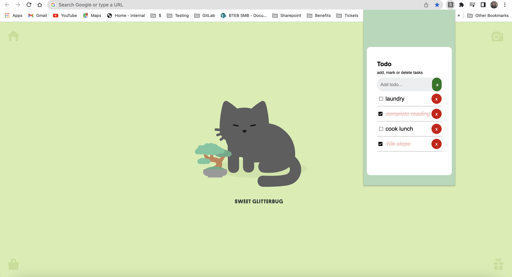
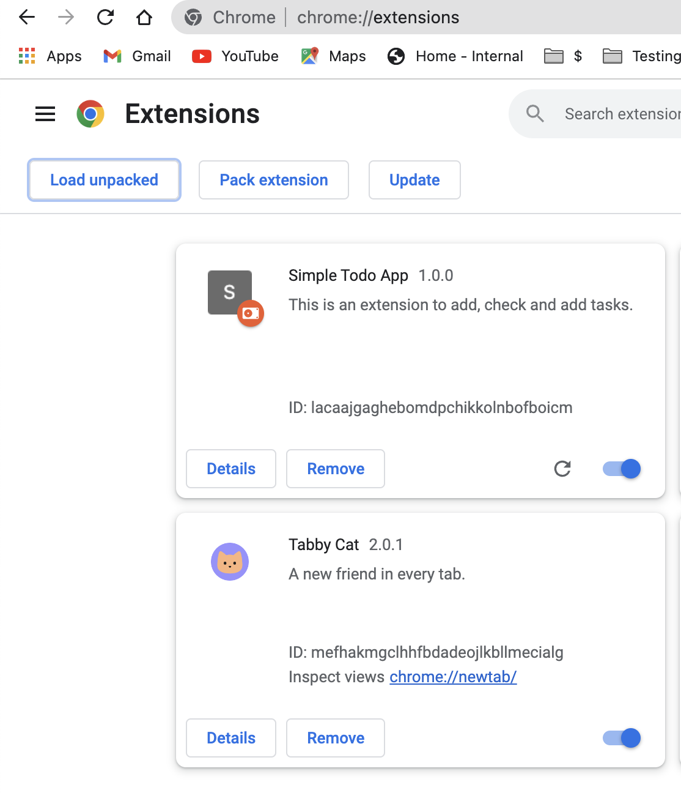

# todo-chrome-ext
building a chrome extension for a simple todo app [(ref)](https://github.com/tanya-sonker/simple-todo)

# steps to host locally
- clone project 
- open chrome > extensions > extensions manager > toggle developer mode > load unpacked

- refresh tab and choose extension
